<p align="center">
  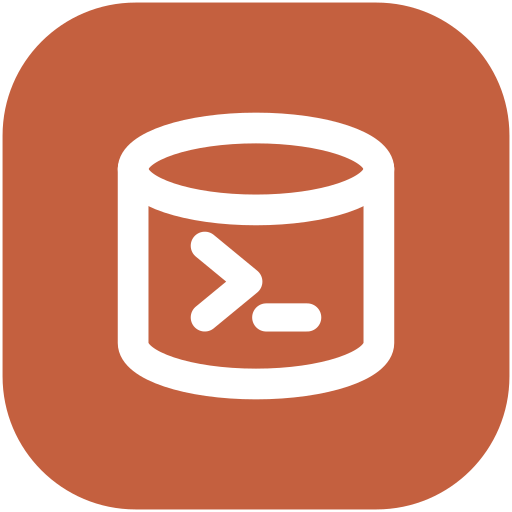
</p>

# QueryHub

**Per-query approval for production databases.** Developers never hold a
production credential: they submit a statement, a DBA approves *that
statement*, and QueryHub executes it under a role matching its
classification — RO, RW or DDL — with the result masked, delivered, and
every decision audited. Apache-2.0, no enterprise tier.

<p align="center">
  <a href="../../actions/workflows/ci.yml"></a>
  <a href="LICENSE"></a>
  
  
  <a href="CHANGELOG.md"></a>
</p>

Two surfaces over one core: `/sql` in **Slack**, or the **web UI**. Engines:
**PostgreSQL** and **SQL Server** (ClickHouse has a safety spec but no
execution path yet).

<p align="center">
  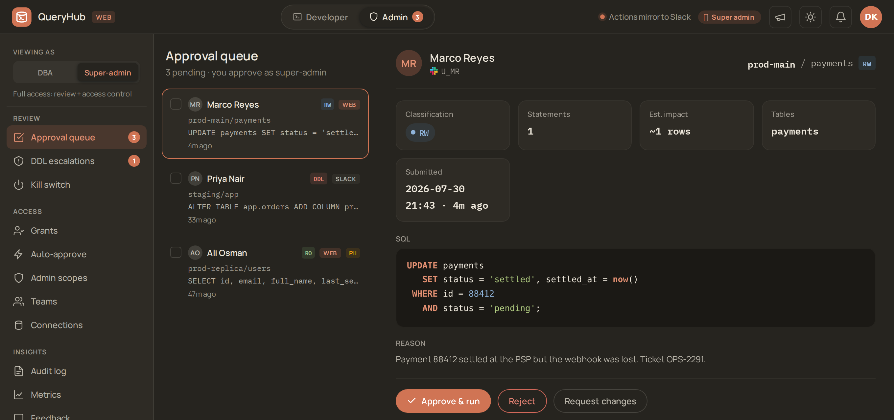<br>
  <em>The product in one screen: a developer's write is waiting, the DBA sees the
  exact statement, what it is classified as, what it will touch and why it was
  asked for — then approves that statement, not a session.</em>
</p>

- [What this is instead of](#how-this-compares) · [Screenshots](#screenshots)
  · [Try it](#try-it-in-two-minutes) · [Install](deploy/INSTALL.md)
  · [Architecture](docs/ARCHITECTURE.md) · [Operations](docs/OPERATIONS.md)
  · [Backup & recovery](docs/DISASTER_RECOVERY.md)
  · [Key rotation](docs/KEY_ROTATION.md)
  · [Personal data](docs/COMPLIANCE.md) · [Versioning](#versioning-and-support)
  · [Contributing](CONTRIBUTING.md)
  · [Changelog](CHANGELOG.md) · [Roadmap](ROADMAP.md)

> **Status: experimental / early.** This project runs in production for
> its author, but the public release is young — interfaces, schema, and
> defaults may change, and hardening is ongoing. Run it behind your own
> network controls; don't expose it to the internet. See
> [docs/KNOWN_LIMITATIONS.md](docs/KNOWN_LIMITATIONS.md) for an honest
> inventory and [ROADMAP.md](ROADMAP.md) for what's next.

> **The problem this solves.** A typical engineering org bottlenecks
> on the DBA team for ad-hoc data questions: "can you check why this
> user is missing?", "how many of X happened yesterday?", "I need a
> CSV of all Y for the report". Each is a Slack DM or ticket; each
> burns a context switch; the data path is informal; nothing is
> audited; access escalates over time as developers accumulate
> long-lived read-only roles "just for this one report".
>
> This bot is the **paved path**: developers submit, an admin
> approves, the bot executes against the right credential tier,
> results come back as a CSV in DM, and every step is in `audit_log`.
> Production access stays narrow; ad-hoc work stops blocking the
> DBA's calendar.

## How this compares

Two products solve adjacent problems, and if you know either one you should be
able to tell in twenty seconds whether this is redundant.

| | QueryHub | Bytebase | Teleport |
| --- | --- | --- | --- |
| **What it governs** | one statement at a time | schema *changes* (migration review is the product) | *access to a session* — it brokers a connection and records the transcript |
| **Reads your SQL?** | yes — classifies each statement RO/RW/DDL and picks the credential to match | yes, for migration review | no; it cannot tell a SELECT from a DROP |
| **Developer holds a credential?** | never | for ad-hoc query, usually yes | yes — a short-lived one, but it is theirs |
| **Approve one query** | the whole model | secondary to change management | not a concept |
| **Where approval happens** | Slack DM or the web panel, with the result landing as a CSV | web console | web console / CLI |
| **Cost of the approval workflow** | Apache-2.0, all of it | custom approval flows are Enterprise | access requests are Enterprise |

The sharpest version: **the two features this project is entirely about —
per-query approval and a custom approval workflow — are the two the
alternatives charge for.**

### Where you will lose by choosing this

Stated plainly, because the wins above are only worth reading if these are here
too:

- **No schema-migration pipeline, no GitOps.** If reviewing and shipping
  migrations is your problem, Bytebase is built for it and this is not.
- **Two engines.** PostgreSQL and SQL Server. Bytebase speaks a dozen-plus.
- **No HA.** One process, one host; see
  [docs/KNOWN_LIMITATIONS.md](docs/KNOWN_LIMITATIONS.md).
- **No infrastructure access.** Teleport governs SSH, Kubernetes and more;
  this governs SQL statements and nothing else.
- **One maintainer**, against funded companies. The
  [status banner](#queryhub) is not modesty.

### Why this shape is about to matter more

Agents are being handed database credentials right now, because that is the
easiest way to let them answer a question. The problem is not new and the fix is
not new either: a caller that should not hold a credential submits a statement, a
human approves that statement, and it runs under a role matching what the
statement actually does. QueryHub is already that, for humans.

Extending it to agents is a small addition rather than a new product — a
principal kind for non-human callers, a hard read-only ceiling for them, and
their prompt recorded next to the SQL. It is on the roadmap
([P3, agent access](ROADMAP.md)), it is **not built yet**, and this section is
positioning, not a feature claim. Note what it is not: QueryHub would govern the
SQL an agent writes, not write SQL from natural language.

### Not this project's job

Not an ORM, a BI tool, or a general query IDE. No dashboards, no charts, no
scheduled reports beyond "run this statement later". If you want to explore
data, use Metabase; QueryHub is the gate in front of the database, not a
window into it.

## Engines

Three states, and the middle one is the interesting one.

| Engine | State | What that means |
|---|---|---|
| **PostgreSQL** | **Executes** | Full three-tier model: RO / RW / DDL, per-tier credentials, streamed results, EXPLAIN pre-flight, PII lineage from the planner. The reference engine. |
| **SQL Server** | **Executes** | Same model. T-SQL safety dialect, cross-catalog and linked-server references refused, AG read-routing for RO. |
| **ClickHouse** | **Parses, refuses to run** | A real safety spec (read-only: only SELECT / WITH are accepted) but no execution path. A target tagged `clickhouse` is rejected **at execution time**, not silently run through the PostgreSQL driver. |
| Anything else | **Not started** | No spec, no driver. Nothing to configure. |

That middle row is deliberate, not an unfinished corner. Pointing psycopg at a
non-PostgreSQL server would "work" often enough to be dangerous — it would also
skip that engine's safety dialect, so a statement classified as read-only under
PostgreSQL rules could be a write under the target's. Refusing an engine it can
parse but cannot execute is the same discipline as refusing SQL whose meaning is
ambiguous: **if the guarantee cannot be made, the query does not run.**

Adding an engine is a spec in [`engines.py`](src/queryhub/engines.py) —
sqlglot dialect, banned leading keywords, driver — plus a resolver in the
lineage and statement-count seams. It is not a fork.

## Screenshots

All of these are the shipped UI rendered from the design prototype's mock data —
no real connection, person or query appears in any of them.

<p align="center">
  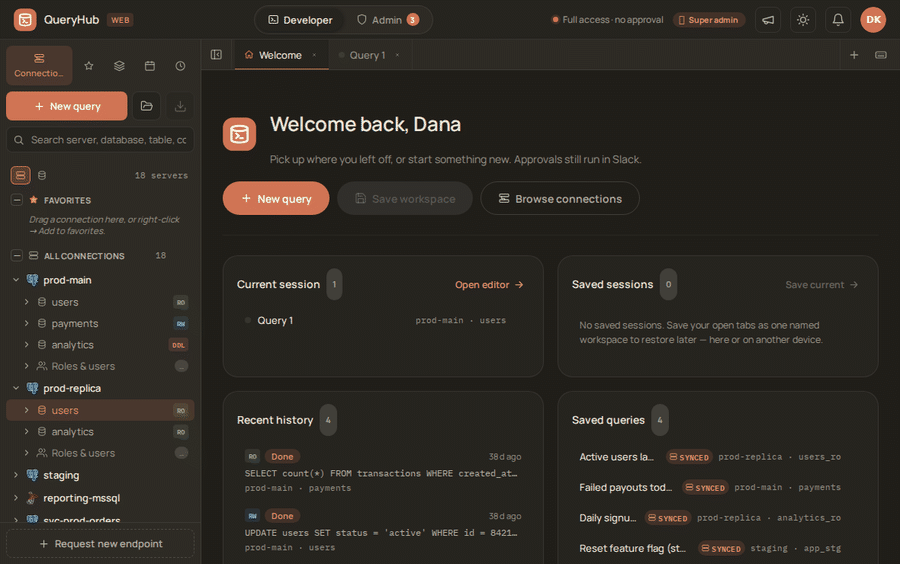<br>
  <em>The whole loop: run a read-only query (auto-approved within your grant,
  PII masked in the result), then switch to the DBA side, review a pending
  write, and approve it — with the decision landing in the audit log.</em>
</p>

<p align="center">
  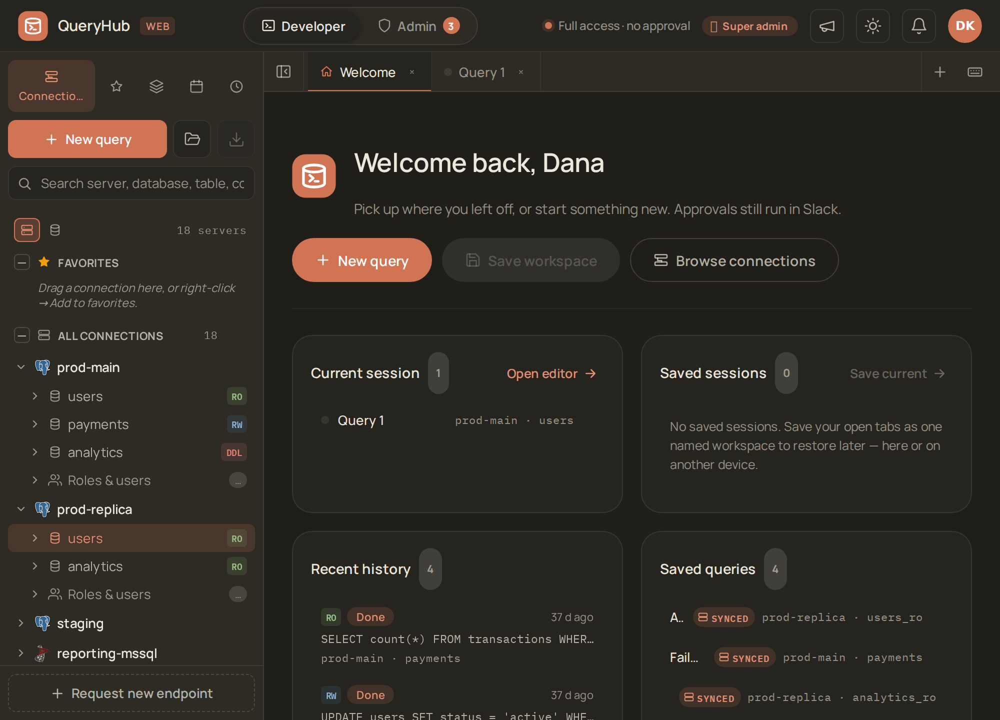<br>
  <em>The workspace: your connections by tier (RO/RW/DDL), recent history,
  saved queries, and open sessions — everything in one place.</em>
</p>

<p align="center">
  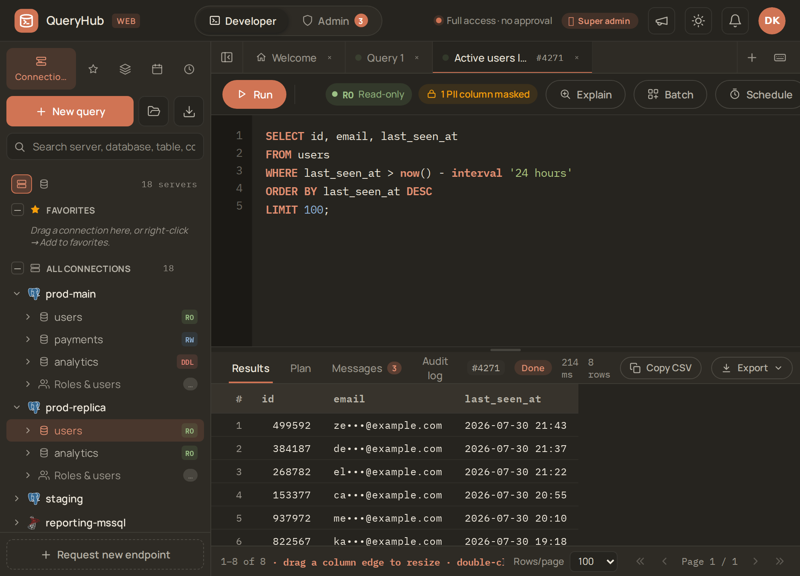<br>
  <em>Write SQL against a tier-matched connection and run it; PII columns are
  masked in the result, and every run is audited.</em>
</p>

<p align="center">
  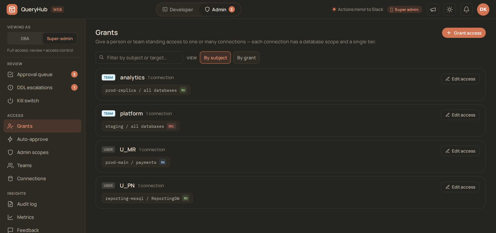<br>
  <em>The three-tier model, made visible: who holds RO / RW / DDL, on which
  connection, scoped to which databases. A team grant and a user grant read the
  same way; the user one wins.</em>
</p>

<p align="center">
  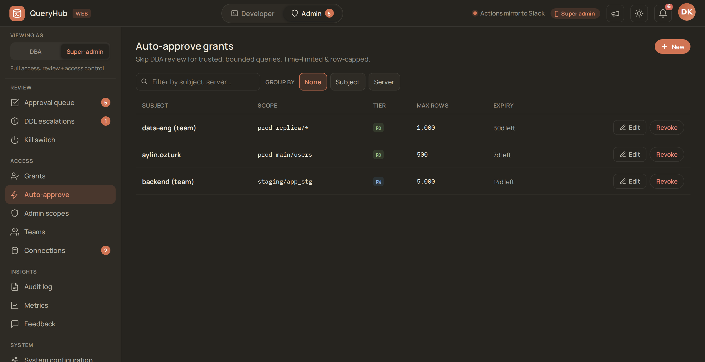<br>
  <em>The pressure valve: a trusted subject can skip review for reads that stay
  inside a row cap and an expiry. Bounded on both axes on purpose — an exemption
  with no clock is a permanent grant with extra steps.</em>
</p>

<p align="center">
  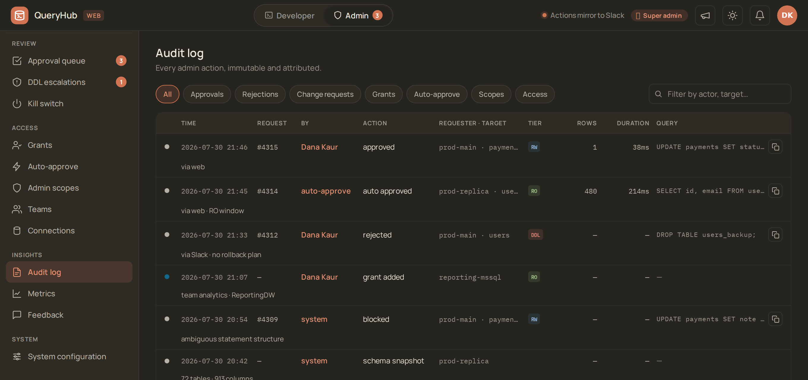<br>
  <em>Every decision, attributed and immutable — approvals, rejections,
  auto-approvals, grant changes, and queries the safety pass refused.</em>
</p>

<p align="center">
  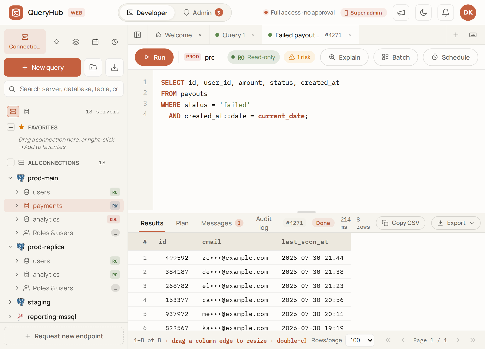<br>
  <em>Light theme, browsing a SQL Server schema — QueryHub speaks PostgreSQL
  and SQL Server behind one pluggable engine layer.</em>
</p>

<p align="center">
  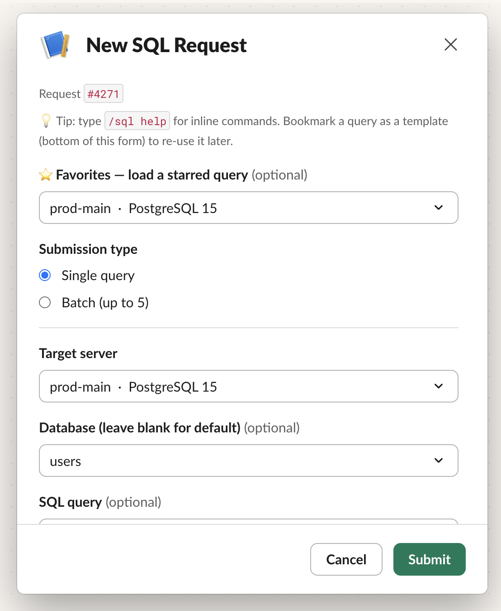
  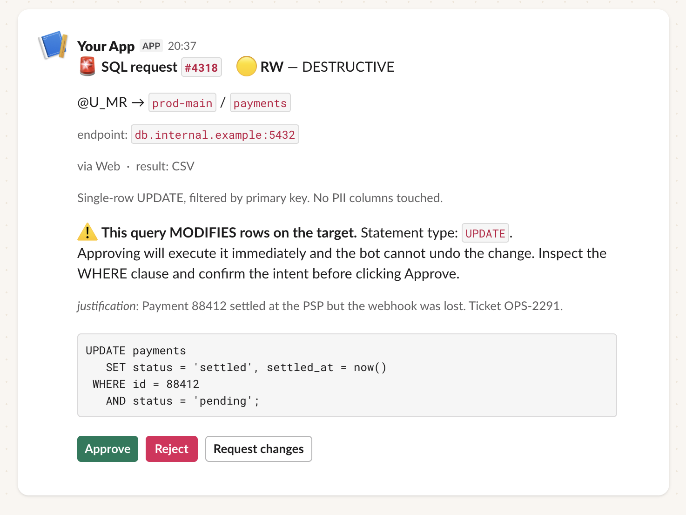<br>
  <em>The same two moments in Slack, for teams that would rather not open a web
  app: <code>/sql</code> to submit, and the card a DBA acts on — the statement,
  what it is classified as, and why it was asked for. Approving runs it; the
  result comes back as a file in a DM.</em>
</p>

<p align="center">
  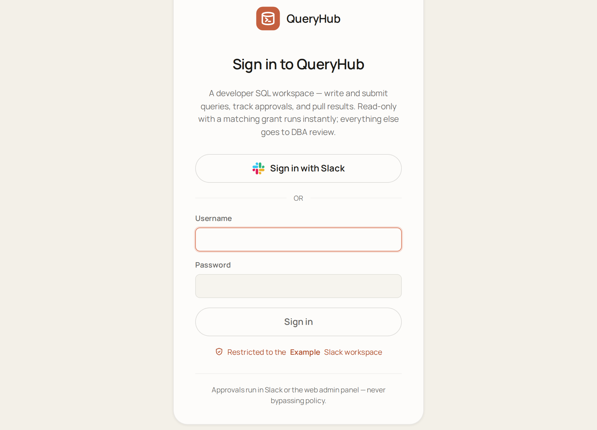<br>
  <em>Sign in with Slack, or with a local username/password in the vanilla
  (no-Slack) profile.</em>
</p>

## What it does

- **Per-statement approval.** The DBA approves the exact SQL that runs. Nothing
  is executed on a credential the developer could have used themselves.
- **Tier-matched execution.** Every statement is classified RO / RW / DDL and
  run under the credential for that tier, re-derived at execution time — an
  edited or superseded query cannot execute at a stale tier.
- **PII masked on the way out.** Values are masked as they stream into the
  result file: by content (IBAN, card, email, phone, national ids —
  checksum-validated, so false positives stay near zero) and by column-name
  catalog for free-text PII with no detectable shape. This is
  accidental-exposure mitigation, not a data boundary — the boundary is column
  privileges and RLS on the database itself, and
  [COMPLIANCE.md](docs/COMPLIANCE.md#4-limiting-third-party-data-what-masking-does-and-does-not-do)
  says exactly where the limits are.
- **Two surfaces, one core.** `/sql` in Slack and the web UI drive the same
  submit → approve → execute → audit path. Approve wherever the interrupt
  arrives; the result comes back as CSV/XLSX either way.
- **Auto-approve, deliberately narrow.** Read-only requests can run instantly
  under a per-user, time-bounded, tier- and target-scoped grant. Everything
  else waits for a human.
- **An audit row for every state change**, written in the same transaction as
  the change — so there is no "it happened but nobody logged it" state.

Batch submission, CSV bulk import, scheduled execution, schema browser, inline
EXPLAIN plans, DDL escalation, admin scopes, per-team grants, product metrics,
ratings, and the full slash-command list are all in
**[docs/FEATURES.md](docs/FEATURES.md)**.


## Try it in two minutes

```bash
git clone https://github.com/ahmetrende/database-queryhub.git
cd database-queryhub
docker compose up
```

Then open **http://localhost:8080** and sign in as `demo-admin` /
`queryhub-demo` (or `demo-dev` for the developer's view).

You get three containers: the app, its metadata database, and a throwaway
"production" Postgres seeded with a shop schema — 10k users, 24k orders, 40k
events — plus the three per-tier login roles. The demo developer holds an RO
grant, so submit `SELECT id, email, phone FROM users LIMIT 10;`, approve it as
`demo-admin`, and watch the result come back with the email and phone masked.
Then try an `UPDATE` and watch it get refused for exceeding the grant.

> **Demo only.** Fixed passwords, a generated master key with no custody plan,
> plain HTTP on localhost, and `target_ssl_mode` relaxed to `prefer` because the
> demo target has no TLS. It is for looking at, not for running anything real.
> The install below is the real thing.

## Prerequisites

Before installing, you need:

| | |
|---|---|
| **(Optional) Slack workspace** | Only for the Slack surface (`/sql` + Slack approvals/DMs): admin access to create / install a custom Slack app with Socket Mode + Bot Token + App Token. Without it, QueryHub runs **web-only** with built-in local accounts — the *vanilla profile* (see below) |
| **PostgreSQL — bot metadata DB** | A Postgres instance the bot can dedicate one DB to (`queryhub` by default). Hosting agnostic: RDS, self-managed, or local for dev |
| **At least one target DB** | The cluster(s) developers query — **PostgreSQL or SQL Server**. Per-tier login roles: `queryhub_ro` / `_rw` / `_ddl` on Postgres, matching logins on SQL Server |
| **Linux host** | A small VM or container that can run Python 3.11+ continuously and reach Slack + your DBs. Install path documented for systemd; a different supervisor works fine |
| **Python 3.11+** | Plus `python3.11-venv`, `libpq-dev`, `git` |
| **(Optional) Web UI** | To expose the web surface: run `python -m queryhub.web` (FastAPI/uvicorn) behind TLS and serve the `QueryHubWeb/` bundle. Web login is either **Slack OIDC** (a Slack app's client id/secret) or **built-in local accounts** (username/password, no Slack) |
| **(Optional) SQL Server driver** | For SQL Server targets: Microsoft ODBC driver (`msodbcsql18`) + the `mssql` extra — `pip install '.[mssql]'` (pulls `pyodbc`) |
| **A Postgres superuser (or rds_superuser) for bootstrap** | Used **once** by `deploy/setup_db.sql` to create the bot's metadata DB and login role |

Full pre-install checklist — Slack app scopes, per-target role
provisioning, network rules, optional integrations — in
[docs/PREREQUISITES.md](docs/PREREQUISITES.md).

## Install

Two commands, then everything else in the UI.

```bash
cp .env.example .env && $EDITOR .env     # metadata DB + first admin
docker compose -f docker-compose.install.yml up -d
```

The first `up` **builds the image from this checkout** — a few minutes, once.
That is the default on purpose: an approval gateway should not change what it
runs because a shared tag moved. To skip the build, pull a released image and
name it:

```bash
docker pull ghcr.io/ahmetrende/database-queryhub:1.0.0
QH_IMAGE=ghcr.io/ahmetrende/database-queryhub:1.0.0 docker compose -f docker-compose.install.yml up -d
```

Every release publishes its own immutable tag alongside `:latest`. Reference the
version, not `latest`, in anything you deploy.

Four values in `.env` matter: `BOT_DB_HOST` / `BOT_DB_PASSWORD` for the
metadata database, and `QH_ADMIN_USER` for the account the first start
creates. Leave `QH_ADMIN_PASSWORD` empty and one is generated and printed
once in `docker compose logs app`; either way it is a bootstrap password,
good for a single login before you are asked to set a real one.

The first start generates the master key, waits for the database, applies
the migrations and creates that admin — then never touches any of it again
on restart.

From there, nothing needs a terminal: sign in and **add a connection**
(alias, host, database, the three per-tier passwords), **test** it,
**create a team** and **grant** it the tier it should have. The one thing
the UI cannot do for you is create the login roles on the database you are
exposing — that is a `GRANT` on their cluster, not ours:
[deploy/grant_readonly.sql](deploy/grant_readonly.sql),
`grant_readwrite.sql`, `grant_ddl.sql`, `grant_mssql.sql`, walked through in
[deploy/NEW_TARGET.md](deploy/NEW_TARGET.md).

Two things this install deliberately leaves to you: **TLS** (the port binds
to loopback; put a reverse proxy in front and set `WEB_BASE_URL` +
`web_cookie_secure=on`) and **backups of the metadata database**, which
holds the audit log.

### On a host, without Docker

The guided installer covers the same ground on a plain VM — idempotent, and
it prompts for secrets rather than reading them from a file (venv → keys →
DB → migrations → first admin → TLS → systemd):

```bash
bash scripts/install.sh
```

Full walk-through, including running the Slack surface alongside the web
app: [deploy/INSTALL.md](deploy/INSTALL.md). Day-to-day operations:
[docs/OPERATIONS.md](docs/OPERATIONS.md).

### With or without Slack

The base install runs **web-only**: no Slack workspace, no Slack SDK. The
`/sql` bot, Slack approvals and Slack DMs are all in the optional `[slack]`
extra; without it those calls no-op and the web UI is the whole product.
Approvals happen in the web admin panel; results and notifications are
served in-app.

Login then uses **built-in local accounts** instead of Slack SSO — that is
what the admin above is. To add more from a shell (the container's
first-start bootstrap is only for the first one), the password is read
interactively and stored only as a salted PBKDF2 hash, never in cleartext:

```bash
python scripts/create_local_user.py --username alice --admin
```

That also flips `web_auth_local_enabled` on. Enabling the Slack surface
later is purely additive (`pip install '.[slack]'` + set the tokens); local
and Slack accounts are distinct principals and can coexist.

## Architecture

- **Shared core, two surfaces** — a transport-agnostic
  submit → decide → execute core (`core_submit.py`, `core_decide.py`,
  `executor.py`) is driven by both the **Slack** app (Bolt + Socket Mode, no
  public endpoint) and **QueryHub Web** (FastAPI, `python -m queryhub.web`).
  Approvals happen in Slack *or* the web admin panel — the same decision core
  either way. See [docs/ARCHITECTURE.md](docs/ARCHITECTURE.md).
- **Pluggable engines** — `engines.py` carries one spec per engine (sqlglot
  dialect, read-only flag, keyword classification, driver); the executor
  dispatches on it. PostgreSQL + SQL Server today; adding an engine is a spec.
- **Postgres metadata DB** — stores config, target server registry,
  admins, requests, audit log, and per-DM message refs (so all admin
  DMs update in lockstep when one admin acts).
- **Three-tier permission model** — RO / RW / DDL credentials per
  target; queries connect with creds matched to their classified tier.
- **Background executor** — `ThreadPoolExecutor` runs approved
  queries with `statement_timeout`, streams rows into a capped CSV.
- **Encrypted at rest** — Fernet (symmetric) ciphertext for target
  credentials, Slack tokens, and the bot DB password. The single
  master key file (`/etc/queryhub/master.key`) is the only on-disk
  secret. To migrate hosts, copy that one file.

Full adapter/port model: [docs/ARCHITECTURE.md](docs/ARCHITECTURE.md).
Every `bot_config` knob: [docs/CONFIGURATION.md](docs/CONFIGURATION.md).
Web session/auth design: [docs/AUTH.md](docs/AUTH.md).

```
src/queryhub/
├── main.py             # entry point: Slack Bolt + Socket Mode
├── config.py           # env vars + bot_config table reads
├── db.py               # metadata DB pool + db.transaction() helper
├── crypto.py           # Fernet wrapper around master.key
├── errors.py           # libpq / ODBC error scrubbing for user messages
├── engines.py          # per-engine spec: dialect, safety, driver (pg/mssql/clickhouse)
├── query_safety.py     # static SQL safety (leading-keyword allow-list)
├── ast_safety.py       # sqlglot AST second pass
├── pre_flight.py       # EXPLAIN at submit + risk hints
├── pii.py              # result PII masking (content + column-name layers)
├── core_submit.py      # transport-agnostic submit pipeline (Slack + web share it)
├── core_decide.py      # transport-agnostic approve / reject / request-changes
├── executor.py         # runs approved queries, builds CSV/XLSX, delivers
├── mssql_exec.py       # SQL Server execution (pyodbc + AG read-only routing)
├── csv_import.py       # /sql import (COPY into the dba schema)
├── targets.py          # target_servers CRUD + per-tier credentials
├── target_policy.py    # alias/host allow-deny globs for target sync
├── teams.py            # team / grant resolution (effective_grant_for_user)
├── grants.py           # grant / revoke cores (+ grantee DM)
├── admins.py           # admin list + scope check + temp-admin grants
├── auto_approve.py     # time-bounded, tier+target-scoped approval exemptions
├── requesters.py       # allowlist + bypass · row_limits.py · ratings.py
├── schema_catalog.py   # hourly target-schema snapshot + browse/search
├── auth_events.py      # authorization-change outbox → DM poller
├── bundles.py · templates.py · favorites.py   # batch, saved queries, favorites
├── audit.py            # audit_log writes (transactional, atomic with state)
├── slack_app/          # Slack surface — modal, notifications, subcommands,
│                       #   ro_window, schema_browser, admin_grant, handlers
└── web/                # QueryHub Web — FastAPI app + Slack-OIDC auth +
                        #   sessions + routes_* + mapping (static UI in QueryHubWeb/)
```

## Slack app required scopes

- **Bot Token**: `chat:write`, `commands`, `users:read`, `im:write`,
  `files:write`
- **App Token** (Socket Mode): `connections:write`
- **Slash command**: `/sql`
- **Interactivity**: enabled (no Request URL needed under Socket Mode)

## Operations

All admin tasks are raw SQL against the bot DB or short CLI scripts.
There are no long-running admin CLIs — see
[docs/OPERATIONS.md](docs/OPERATIONS.md) for copy-paste snippets.
Quick links:

- **Bot lifecycle** — `systemctl restart queryhub`,
  `journalctl -u queryhub -f`
- **Encrypted secrets** —
  `scripts/manage_env_secrets.py {init,list,set,remove}`
- **Targets** — `scripts/encrypt_secret.py` then INSERT via
  `deploy/db_admin_templates.sql`
- **Admins / requesters / teams / grants** — INSERTs / UPDATEs in
  `deploy/db_admin_templates.sql` and `deploy/team_admin_templates.sql`
- **Runtime config** — `UPDATE bot_config SET value=... WHERE key=...`

## Audit & history

```sql
SELECT id, requester_slack_id, status, decided_by_slack_id,
       row_count, created_at, completed_at
  FROM requests ORDER BY id DESC LIMIT 50;

SELECT * FROM audit_log WHERE request_id = 42 ORDER BY created_at;
```

More patterns (in-flight, by user, plan capture, etc.) in
`docs/OPERATIONS.md` section 10.

## Security model

> Found a vulnerability? Report it **privately** — see
> [SECURITY.md](SECURITY.md) (GitHub **Security → Report a vulnerability**),
> not a public issue.

- **Application layer**: requesters allowlist → team / user grants →
  query-safety analysis (allow-list of leading keywords, multi-statement
  reject, CTE-DML reject, WHERE-required for UPDATE/DELETE,
  always-true-WHERE detection) → admin approval → tier-matched
  credentials at execute time.
- **Postgres layer (optional)**: per-team `target_role` granted at the
  cluster level; the executor `SET LOCAL ROLE`s into it before running
  the query. See `deploy/grant_team_role.sql` and
  `scripts/plan_team_role_provisioning.py`.
- **Crypto layer**: target credentials and the env secrets file are
  Fernet-encrypted with a single master key (mode 0600 on disk).
- **PII masking**: result values are masked as they stream into the
  CSV/XLSX file. Two layers: (1) **content-based** — by value, not
  column name, so an aliased / wrapped column can't slip PII past the
  mask: email, phone, Turkish national ID (TCKN), tax number (VKN),
  IBAN, card number — the last four checksum-validated (TC/VKN
  algorithms, IBAN mod-97, Luhn + network prefix) to keep false
  positives near zero; (2) **column-name catalog** (`pii_column_patterns`)
  for free-text PII with no detectable format (name, address) — a
  result column whose name matches a configured pattern is masked by
  type; operators extend the catalog with no code change. Which kinds
  fired is recorded in `audit_log` and surfaced to the requester.
  Toggle: `bot_config.pii_masking_enabled`.
- **Audit**: every state change is paired with an `audit_log` insert
  in the same transaction (`db.transaction()` + `audit.log_in()`).

## Versioning and support

SemVer, and specific about what the major number covers rather than leaving it
to the word "stable".

**Inside the compatibility promise** — a minor release will not break these:

- **`bot_config` keys** documented in [docs/CONFIGURATION.md](docs/CONFIGURATION.md).
  A key may gain a value; it will not change meaning or disappear.
- **the audit contract**, below.
- **migrations are append-only**, below.

**Outside it, and deliberately so:**

- **The HTTP endpoints the bundled UI calls.** They are that UI's private
  interface, not an integration surface: they are shaped by the screen that
  consumes them and both ship together. Building against them means pinning a
  version. If you want a supported programmatic surface, open an issue — saying
  this plainly is better than promising stability nobody is holding to.
- **The frontend**, entirely.
- **The database schema.** Migrations are forward-only and
  `apply_migrations.py` handles the upgrade, but a downgrade is a restore, so
  treat the schema as ours and the audit contract as yours.

**Will not change without a major version:**

- **the audit contract** — every state change keeps a row, written in the same
  transaction as the change. No release makes an existing `audit_log` row
  unreadable or ambiguous,
- **migrations are append-only** — a released migration is never edited, only
  superseded, and the ledger stores a checksum so an edit is caught,
- **the tier model** — a statement classified RO never executes on a
  write-capable credential.

**Support window.** Security fixes land on `main` and on the most recent tagged
release. There is no LTS and no backporting to older minors: one maintainer
([MAINTAINERS.md](MAINTAINERS.md)) cannot honestly promise one, so it is not
promised. If you pin a version, plan to move forward for security fixes.

Release process, including what is checked before a tag:
[RELEASING.md](RELEASING.md).

## Contributing

Issues and pull requests are welcome — see [CONTRIBUTING.md](CONTRIBUTING.md)
for the development setup (including the frontend build) and
[CODE_OF_CONDUCT.md](CODE_OF_CONDUCT.md). Changes worth a line in the release
notes go in [CHANGELOG.md](CHANGELOG.md).

## License

Licensed under the [Apache License 2.0](LICENSE) —
`SPDX-License-Identifier: Apache-2.0`. No open-core split: every feature
described above is in this repository.

Dependencies carry their own terms, and one of them matters:
**psycopg is LGPL-3.0**. That and every other third-party licence, plus the
engine trademarks and the proprietary Microsoft ODBC driver the SQL Server
extra needs, are in [THIRD_PARTY_NOTICES.md](THIRD_PARTY_NOTICES.md).
