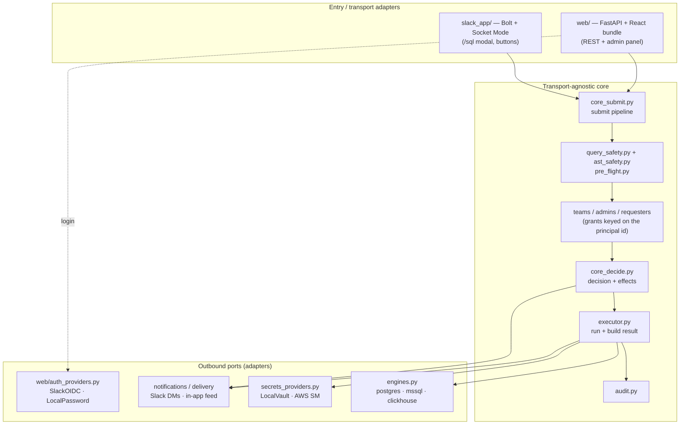

# Architecture — core & adapters

QueryHub is a **transport-agnostic core** surrounded by a handful of
**adapters** (ports). The core owns the actual product logic — submit,
safety-check, approve, execute, audit — and never talks to Slack, a browser,
a cloud vendor, or a specific database engine directly. Each of those is a
port with one or more interchangeable adapters, most of them toggleable at
runtime. This is what lets the same code run as a Slack bot, as a web app,
or as both at once, and run with or without any external vendor.

## The core (never vendor-specific)

| Module | Responsibility |
|---|---|
| `core_submit.py` | The one submit pipeline both surfaces call: validate → safety → EXPLAIN/risk → persist the request (with engine + required tier). |
| `query_safety.py`, `ast_safety.py`, `pre_flight.py` | Static leading-keyword allow-list, sqlglot AST second pass, submit-time EXPLAIN + risk hints. |
| `teams.py`, `admins.py`, `requesters.py`, `auto_approve*.py` | Authorization. Everything keys on the **principal id** — one text column, provider-namespaced (`Uxxx` for Slack, `local:<username>` for local). |
| `core_decide.py` | `decide()` records the approve/reject/schedule transition + audit row; `apply_effects()` fans out the side effects. |
| `executor.py` | Runs the approved query with the tier-matched credential, builds CSV/XLSX, records outcome. |
| `audit.py` | Append-only audit trail. |

## The ports (adapters)

### 1. Entry / transport — `slack_app/` and `web/`
Two front doors, one core. The Slack app (`slack_app/`, Bolt + Socket Mode)
and the web API (`web/`, FastAPI) both build a request and hand it to
`core_submit`; both call `core_decide` to approve. Approving in the web
panel runs the *identical* decision core as a Slack button — see
`web/routes_admin.py::admin_decision`.

### 2. Authentication — `web/auth_providers.py`
A provider turns a login into a **principal id** (`Identity`). `SlackOIDC`
(kind `oauth`, redirect round-trip) and `LocalPassword` (kind `password`,
username/password) are registered in `_ALL` and toggled by
`web_auth_slack_enabled` / `web_auth_local_enabled`. The rest of the system
never learns *how* someone logged in — only the principal id, which every
grant/admin/audit row is keyed on. (Local passwords are stored only as a
salted PBKDF2 hash — see `passwords.py`.)

**Identity naming.** Every `*_slack_id` / `slack_user_id` column holds a
provider-namespaced **principal id**, not necessarily a Slack id: a Slack
principal looks like `U01ABCDEFGH`, a local account like `local:alice`. The
columns are named after the first provider that existed, and renaming them is a
migration across ten tables for no behavioural gain — so the names stay and this
note exists instead. Read them as "principal id" wherever you see them; the
CHECK constraints (migration 075) accept both shapes deliberately.

### 3. Notification & result delivery — Slack vs in-app
`slack_app/notifications.py` (admin fan-out, submitter DMs) and the
executor's Slack upload are the **Slack** delivery adapter. The **web**
adapter is the in-app notifications feed + serving the result from the
executor's masked CSV. Every Slack send is guarded by
`config.ENV.slack_enabled`; in the vanilla profile they all no-op and the
web UI is the only delivery path. (`ENV.slack_enabled` is simply
`bool(slack_bot_token)`.)

### 4. Target credentials — `secrets_providers.py`
`SecretsProvider` is a `Protocol` with one method,
`get_credentials(row, mode) -> (user, password)`. `LocalVaultProvider`
(`name="local"`) decrypts per-tier credentials from the Fernet vault; the
AWS Secrets Manager provider (`awssm`) fetches them just-in-time. A target
row's `secrets_provider` column selects which is used, defaulting to
`local`. The cloud SDK is only imported when a target actually uses it.

### 5. Database engine — `engines.py`
`EngineSpec` describes a target's dialect, tiering and safety rules;
`_ENGINES` registers `postgres`, `mssql` and `clickhouse`. `WIRED_ENGINES`
gates *execution*, so an engine can ship a spec (safety rules understood)
before its executor path is enabled. `query_safety`/`ast_safety` take the
engine so a T-SQL statement is never classified by the Postgres parser.

## Profiles (optional dependencies)

The adapters map to `pip` extras (see `pyproject.toml`):

| Profile | Install | Adapters present |
|---|---|---|
| **vanilla** (base) | `pip install .` | web transport, local auth, in-app delivery, local Fernet vault, Postgres engine |
| **slack** | `pip install '.[slack]'` | + Slack transport, Slack auth, Slack delivery/notifications |
| **mssql** | `pip install '.[mssql]'` | + SQL Server engine (pyodbc) |
| **aws** | `pip install '.[aws]'` | + AWS Secrets Manager credential provider |

The base install has **zero external vendors**: it runs web-only on
Postgres with built-in local login. Adding a profile is purely additive and
never changes the core.

## Adding a new adapter

- **A new transport** (e.g. Microsoft Teams, a CLI): build the request and
  call `core_submit`; call `core_decide.decide` + `apply_effects` to
  approve. Don't reach into `executor`/`teams` directly — go through the
  core so safety, tiering and audit are applied uniformly.
- **A new auth provider:** add a class with `name`, `label`, `kind`,
  `enabled()`, and either `start`/`exchange` (oauth) or `verify` (password),
  returning an `Identity(principal_id, …)`. Register it in
  `auth_providers._ALL` and gate it with a `bot_config` key.
- **A new notification/delivery channel:** add the sender behind the same
  `ENV.slack_enabled`-style guard so an unconfigured channel no-ops rather
  than erroring.
- **A new secrets provider:** implement the `SecretsProvider` protocol and
  register it; select it per target via `target_servers.secrets_provider`.
- **A new engine:** add an `EngineSpec` to `engines.py`; only add it to
  `WIRED_ENGINES` once its executor path and safety rules are proven.
