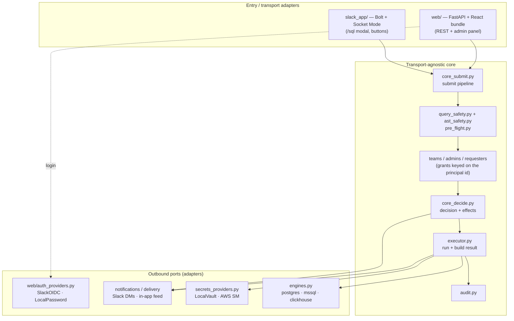

# Architecture — core & adapters

QueryHub is a **transport-agnostic core** with a handful of **adapters**
(ports) around it. This design lets the same code run as a Slack bot, as
a web app or as both at once. The code can run with or without any
external vendor.

The core owns the actual product logic: submit, safety-check, approve,
execute and audit. It never talks directly to Slack, a browser, a cloud
vendor or a specific database engine. Each of those is a port with one or
more interchangeable adapters. Most of the adapters have a runtime toggle.

```mermaid
flowchart TB
    subgraph entry["Entry / transport adapters"]
        slack["slack_app/ — Bolt + Socket Mode<br/>(/sql modal, buttons)"]
        web["web/ — FastAPI + React bundle<br/>(REST + admin panel)"]
    end

    subgraph core["Transport-agnostic core"]
        submit["core_submit.py<br/>submit pipeline"]
        safety["query_safety.py + ast_safety.py<br/>pre_flight.py"]
        authz["teams / admins / requesters<br/>(grants keyed on the principal id)"]
        decide["core_decide.py<br/>decision + effects"]
        exec["executor.py<br/>run + build result"]
        audit["audit.py"]
    end

    subgraph ports["Outbound ports (adapters)"]
        authp["web/auth_providers.py<br/>SlackOIDC · LocalPassword"]
        notify["notifications / delivery<br/>Slack DMs · in-app feed"]
        secrets["secrets_providers.py<br/>LocalVault · AWS SM"]
        engine["engines.py<br/>postgres · mssql · clickhouse"]
    end

    slack --> submit
    web --> submit
    submit --> safety --> authz --> decide --> exec --> audit
    web -.login.-> authp
    decide --> notify
    exec --> notify
    exec --> secrets
    exec --> engine
```

## The core (never vendor-specific)

| Module | Responsibility |
|---|---|
| `core_submit.py` | The one submit pipeline both surfaces call: validation → safety → EXPLAIN/risk → persist the request (with engine + required tier). |
| `query_safety.py`, `ast_safety.py`, `pre_flight.py` | Static leading-keyword allow-list, sqlglot AST second pass, submit-time EXPLAIN + risk hints. |
| `teams.py`, `admins.py`, `requesters.py`, `auto_approve*.py` | Authorization. Everything keys on the **principal id**: one text column, provider-namespaced (`Uxxx` for Slack, `local:<username>` for local). |
| `core_decide.py` | `decide()` records the approve/reject/schedule transition and its audit row. `apply_effects()` dispatches the side effects. |
| `executor.py` | Runs the approved query with the tier-matched credential, builds the CSV/XLSX and records the outcome. |
| `audit.py` | Append-only audit trail. |

## The ports (adapters)

### 1. Entry / transport — `slack_app/` and `web/`
Two front doors share one core. The Slack app (`slack_app/`, Bolt +
Socket Mode) and the web API (`web/`, FastAPI) both build a request and
pass it to `core_submit`. Both call `core_decide` to approve. An approval
in the web panel runs the *identical* decision core as a Slack button. See
`web/routes_admin.py::admin_decision`.

### 2. Authentication — `web/auth_providers.py`
A provider turns a login into a **principal id** (`Identity`). `_ALL`
registers these providers, and a setting toggles each one:

- `SlackOIDC` (kind `oauth`, redirect round-trip): `web_auth_slack_enabled`
- `LocalPassword` (kind `password`, username/password):
  `web_auth_local_enabled`

The rest of the system never learns *how* someone logged in. It sees only
the principal id, which is the key of every grant, admin and audit row.
(The app stores local passwords only as a salted PBKDF2 hash. See
`passwords.py`.)

**Identity naming.** Read every `*_slack_id` / `slack_user_id` column as
"principal id". Each one holds a provider-namespaced **principal id**, not
necessarily a Slack id. A Slack principal looks like `U01ABCDEFGH`, and a
local account looks like `local:alice`. The columns carry the name of the
first provider that existed. A rename is a migration across ten tables for
no behavioural gain, so the names stay and this note exists instead. The
CHECK constraints (migration 075) accept both shapes on purpose.

### 3. Notification & result delivery — Slack vs in-app
`slack_app/notifications.py` (admin fan-out, submitter DMs) and the
executor's Slack upload are the **Slack** delivery adapter. The **web**
adapter is the in-app notifications feed, plus the result served from the
executor's masked CSV. `config.ENV.slack_enabled` guards every Slack send.
In the vanilla profile every Slack send is a no-op, and the web UI is the
only delivery path. (`ENV.slack_enabled` is simply
`bool(slack_bot_token)`.)

### 4. Target credentials — `secrets_providers.py`
`SecretsProvider` is a `Protocol` with one method,
`get_credentials(row, mode) -> (user, password)`. `LocalVaultProvider`
(`name="local"`) decrypts per-tier credentials from the Fernet vault. The
AWS Secrets Manager provider (`awssm`) fetches them just-in-time. The
`secrets_provider` column of a target row selects the provider, and the
default is `local`. The app imports the cloud SDK only when a target
actually uses it.

### 5. Database engine — `engines.py`
`EngineSpec` describes a target's dialect, tiering and safety rules.
`_ENGINES` registers `postgres`, `mssql`, `clickhouse` and `athena`, and all
four execute today. `WIRED_ENGINES`
gates *execution*. So an engine can ship a spec (safety rules understood)
before its executor path is live. `query_safety`/`ast_safety` take the
engine, so the Postgres parser never classifies a T-SQL statement.

**Read replicas** are a routing decision, not an engine. A replica is a
`target_servers` row with `replica_of` set, hidden from every picker.
`replicas.choose()` runs in the executor, after re-authorization and before
the claim. It sends a read-only PostgreSQL request to a healthy, enabled
replica, and everything else to the target itself. The request, its grant
and its audit stay on the primary. `requests.executed_target_id` records
where it ran, and the cancel path signals that server.

## Profiles (optional dependencies)

The adapters map to `pip` extras (see `pyproject.toml`):

| Profile | Install | Adapters present |
|---|---|---|
| **vanilla** (base) | `pip install .` | web transport, local auth, in-app delivery, local Fernet vault, Postgres engine |
| **slack** | `pip install '.[slack]'` | + Slack transport, Slack auth, Slack delivery/notifications |
| **mssql** | `pip install '.[mssql]'` | + SQL Server engine (pyodbc) |
| **aws** | `pip install '.[aws]'` | + AWS Secrets Manager credential provider |

The base install has **zero external vendors**: it runs web-only on
Postgres with built-in local login. A profile is purely additive. Adding
one never changes the core.

## Adding a new adapter

- **A new transport** (e.g. Microsoft Teams, a CLI):
  1. Build the request.
  2. Call `core_submit`.
  3. To approve, call `core_decide.decide` + `apply_effects`.

  Do not use `executor`/`teams` directly. Use the core, so that safety,
  tiering and audit apply uniformly.
- **A new auth provider:**
  1. Add a class with `name`, `label`, `kind`, `enabled()`, and either
     `start`/`exchange` (oauth) or `verify` (password). It returns an
     `Identity(principal_id, …)`.
  2. Register it in `auth_providers._ALL`.
  3. Gate it with a `bot_config` key.
- **A new notification/delivery channel:** put the sender behind the same
  `ENV.slack_enabled`-style guard. An unconfigured channel is then a
  no-op, not an error.
- **A new secrets provider:**
  1. Implement the `SecretsProvider` protocol.
  2. Register the provider.
  3. Select it per target with `target_servers.secrets_provider`.
- **A new engine:**
  1. Add an `EngineSpec` to `engines.py`.
  2. Add it to `WIRED_ENGINES` only after its executor path and safety
     rules are proven.
